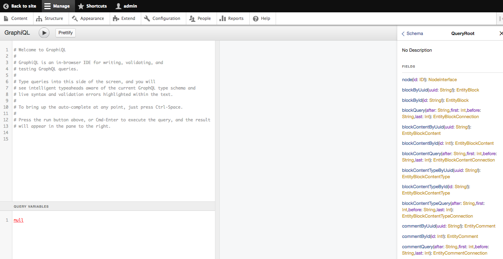

# Exploring

The GraphQL module comes with a bundled version of the standard GraphQL explorer
([Official repo], [Introduction post]). To use it, just visit `(your_site)/graphql/explorer`

[Official repo]: https://github.com/graphql/graphiql
[Introduction post]: https://medium.com/the-graphqlhub/graphiql-graphql-s-killer-app-9896242b2125#.bzg213epl
